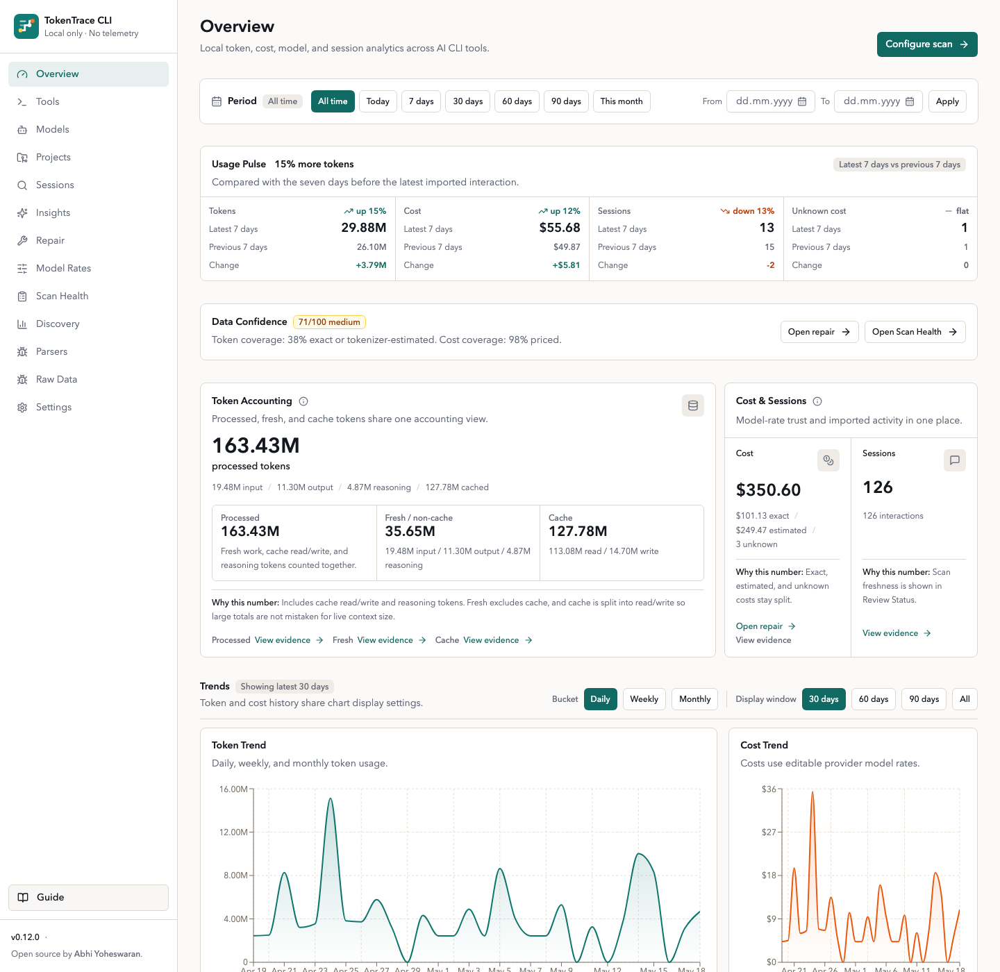
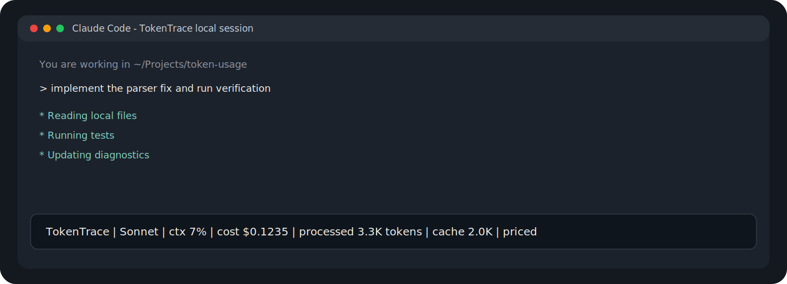
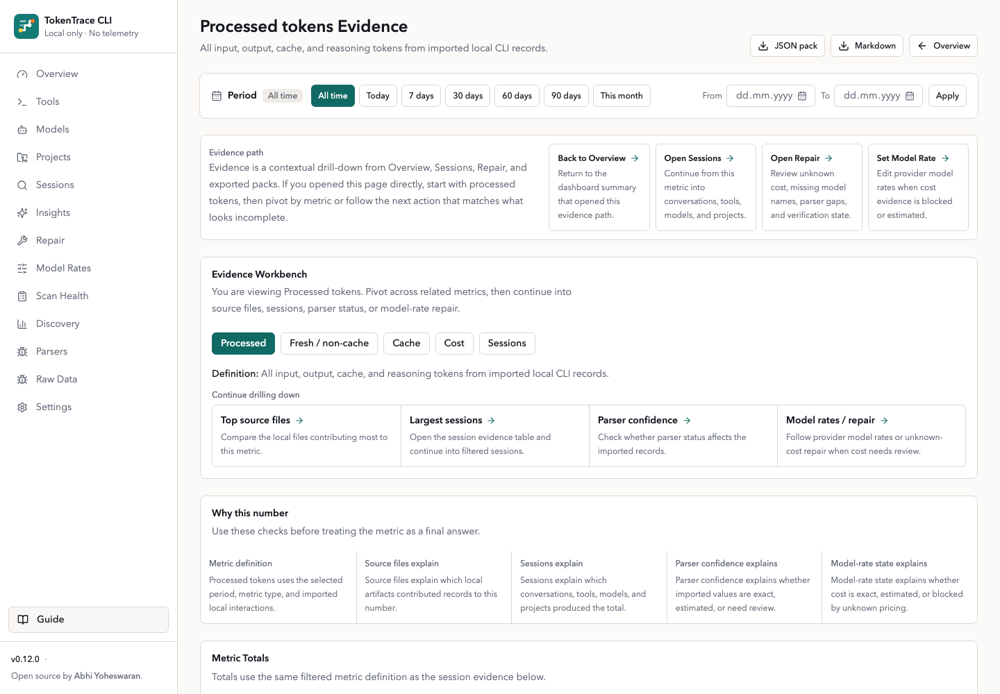
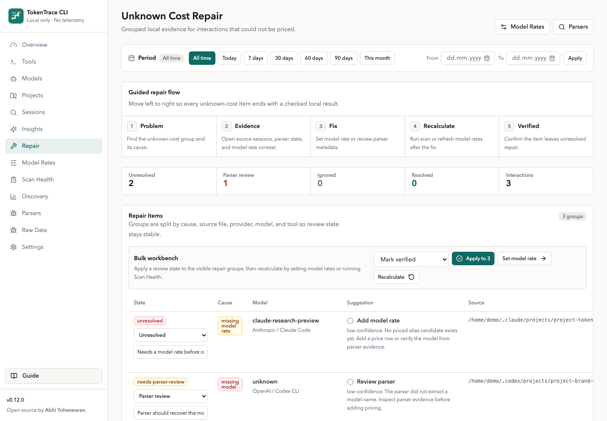
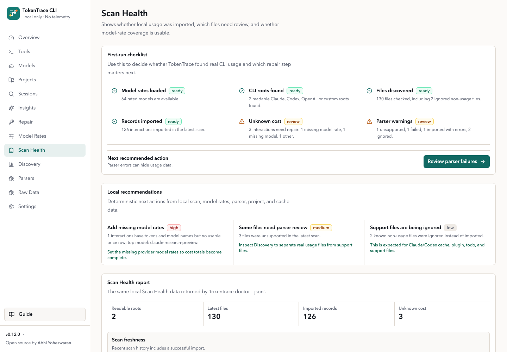

<p align="center">
  
</p>

# TokenTrace CLI

Local-first AI CLI usage analytics. TokenTrace scans local CLI logs and local usage databases, normalizes token usage, estimates missing counts with confidence labels, and shows cost, model, project, session, repair, and evidence analytics in a browser dashboard.

TokenTrace is designed for local development machines first, with macOS-oriented defaults. It does not require a cloud account and does not send telemetry or logs anywhere.

[Website](https://www.abhiyoheswaran.com/apps/tokentrace) · [Source](https://github.com/abhiyoheswaran1/tokentrace)



## Start In Seconds

Run without installing:

```bash
npx tokentrace
```

Or install globally:

```bash
npm install -g tokentrace
tokentrace
```

The command starts the local dashboard, chooses an available localhost port starting at `3030`, opens your default browser, and keeps the server running until you press `Ctrl+C`.

CLI commands:

```bash
tokentrace              # Start local dashboard
tokentrace serve        # Start local dashboard
tokentrace serve --port 3210 --no-open
                        # Start on a fixed port without opening a browser
tokentrace agent --json # Print machine-readable agent discovery manifest
tokentrace capabilities --json
                        # Alias for agent discovery manifest
tokentrace roadmap --json
                        # Print release status handoff
tokentrace mcp          # Start the local stdio MCP server
tokentrace scan         # Scan local AI CLI usage logs
tokentrace doctor --json
                        # Inspect scan health and repair recommendations
tokentrace evidence --json
                        # Print metric evidence trails as JSON
tokentrace repair --json
                        # Print unknown-cost repair groups as JSON
tokentrace digest --json
                        # Print current-month local usage digest
tokentrace digest --since yesterday
                        # Print a scoped local usage digest
tokentrace report --markdown
                        # Print a deterministic Markdown report
tokentrace review --json
                        # Print post-session scan and review movement
tokentrace insights --json
                        # Print local recommendations as JSON
tokentrace status --json
                        # Print local usage status as JSON
tokentrace statusline claude
                        # Render a Claude Code status line from stdin
tokentrace statusline claude --compact
                        # Render a shorter Claude Code status line
tokentrace statusline setup claude
                        # Print Claude Code statusLine setup JSON
tokentrace watch --session
                        # Watch local usage status in a terminal split
tokentrace watch --session --compact
                        # Watch a compact live status line
tokentrace pricing refresh
                        # Refresh public model prices
tokentrace run <cmd>    # Optional wrapper mode for command runtime diagnostics
tokentrace reset        # Reset imported local data
tokentrace reset --yes  # Reset without confirmation
tokentrace --help       # Print help
tokentrace --version    # Print version
```

## For Coding Agents

Agents should start with the read-only discovery manifest:

```bash
tokentrace agent --json
```

The alias below returns the same manifest:

```bash
tokentrace capabilities --json
```

The manifest describes TokenTrace's local-first privacy model, safe JSON commands,
common workflows, Claude Code status-line setup, Codex sidecar fallback, and
guardrails such as never running `tokentrace reset` without explicit human
approval. The discovery command does not scan files, initialize the database, or
start the dashboard.

Package-level agent references are included for agents that inspect repository
or npm package contents before invoking commands:

- [TOKENTRACE_AGENT.md](TOKENTRACE_AGENT.md)
- [llms.txt](llms.txt)
- [docs/agent-discovery.schema.json](docs/agent-discovery.schema.json)

MCP-capable clients can start the local stdio server after installing or using
the npm package:

```bash
tokentrace mcp
```

The MCP server exposes the same local-first surfaces as tools: capabilities,
status, Scan Health, evidence, repair queue, reports, and an explicit scan tool.
It does not scan files on startup, and its scan tool requires
`confirmLocalScan=true` before reading local usage files or writing the local
database.

When the local dashboard is already running, agents can fetch the same manifest
over localhost:

```bash
curl http://127.0.0.1:3030/api/agent
curl http://127.0.0.1:3030/api/capabilities
```

The Local Sources & Trust release handoff is also machine-readable:

```bash
tokentrace roadmap --json
curl http://127.0.0.1:3030/api/roadmap
```

## Run From Source

```bash
npm install
npm run db:migrate
npm run db:seed
npm run dev
```

Open `http://localhost:3000`.

Useful source commands:

```bash
npm run dev          # Start the Next.js dev server
npm run build        # Build the production app
npm run start        # Serve the production build
npm run scan         # Scan default and configured folders
npm run db:migrate   # Create/update local SQLite tables
npm run db:seed      # Seed editable provider/model prices
npm run screenshots:seed
                    # Seed a guarded public-safe screenshot database
npm run reset        # Clear imported data and scan history
npm test             # Run parser and cost tests
npm run verify       # Run Vitest, TypeScript, and ESLint checks
npm run package:test # Verify, build, and dry-run the npm package
npm run package:inspect
                    # Check package transparency guardrails
npm run security:ioc
                    # Scan lockfiles, workflows, and local AI-tool hooks for supply-chain IOCs
npm run smoke:packed
                    # Inspect packed tarball and smoke test packed CLI
tokentrace roadmap --json
                    # Inspect roadmap handoff, action recipes, and release status
```

## Local Sources And Trust

TokenTrace 0.12.0 bundles local source expansion, evidence exports, scan
scheduling, scoped guardrails, parser profile preview, saved reports, and
agent-readable release status.

New trust surfaces include:

- native structured usage log and Cursor-style chat export ingestion
- Source Coverage in Scan Health for native, profile-assisted, fallback, and
  unsupported files
- privacy-safe Evidence Packs as JSON or Markdown
- local scan scheduling: manual, on-open, hourly, or daily
- project/model/tool scoped guardrails with warning thresholds
- Import Profile preview before saving matchers
- saved report exports for weekly usage, source coverage, guardrails, unknown
  cost, high-cost sessions, and confidence trends
- operating metadata export without raw usage records

The 0.12.0 dashboard also tightens the daily operator path: setup buttons now
open the exact Settings section, scan results show what changed and where to go
next, and Evidence explains when it is being opened as a contextual drill-down
rather than a sidebar destination.

## Accuracy And Evidence

TokenTrace labels the trust level behind imported numbers:

- exact provider token counts
- tokenizer estimates for recognized OpenAI/Codex and Claude-family model names
- simple estimates when only text-like content is available
- source-provided costs from local SQLite histories
- unknown cost repair groups when model, token, or rate evidence is missing

The dashboard surfaces a Data Confidence score on Overview, Projects, Sessions,
and Session Timeline pages. Scan Health also includes a supply-chain IOC check
so package trust is visible in the product, not only in release scripts.

Public releases require maintainer approval. See
[docs/RELEASE_CHECKLIST.md](docs/RELEASE_CHECKLIST.md) before bumping versions,
tagging, creating GitHub releases, or publishing npm.

In local development, the SQLite database defaults to `.tokentrace/tokentrace.db`. Override it with:

```bash
TOKENTRACE_DB=/absolute/path/tokentrace.db npm run dev
```

## Data Location

When installed from npm, TokenTrace stores runtime data outside the package folder:

- macOS: `~/Library/Application Support/TokenTrace/`
- Linux: `~/.local/share/tokentrace/`
- Windows: `%APPDATA%/TokenTrace/`

The CLI sets `TOKENTRACE_DB` and `DATABASE_URL` automatically. You can override the base directory with:

```bash
TOKENTRACE_HOME=/custom/path tokentrace
```

If `npm install -g tokentrace` prints a `prebuild-install` deprecation warning, it is from the native SQLite dependency chain used by `better-sqlite3`. The install should continue normally, and TokenTrace still runs locally.

## Where TokenTrace Looks

Default discovery checks these locations when present:

- `~/.claude/`
- `~/.config/claude/`
- `~/.codex/`
- `~/.config/codex/`
- `~/.openai/`
- Project-level hidden folders such as `.claude`, `.codex`, `.openai`, and `.ai` in the directory where `tokentrace` was invoked
- TokenTrace wrapper logs in the local app-data directory
- Any custom folders configured in Settings

Use **Settings** in the dashboard to add custom folders, toggle raw message storage, and trigger scans. Use **Scan Health**, **Discovery**, **Parsers**, and **Raw Data** to inspect discovered files, parser decisions, warnings, failures, extracted metadata, and confidence levels.

Settings also supports optional local monthly usage guardrails. Set a cost
limit, token limit, or both, and Overview will show month-to-date progress from
imported local CLI usage.

Sessions includes built-in and local saved views for recurring review paths:
unknown cost, high-cost sessions, Claude/Codex this month, estimated tokens,
guardrail review, and parser review. Open a session's **Timeline** link to see
ordered interactions, model changes, token spikes, cache activity, tool calls,
parser confidence, and unknown-cost events. Raw prompts and message bodies stay
hidden by default.

## Ingestion Architecture

TokenTrace's primary ingestion architecture is direct local filesystem ingestion:

1. Discover local AI CLI artifacts.
2. Parse supported formats through adapters.
3. Normalize sessions, interactions, token usage, models, projects, and tool calls.
4. Store normalized records locally in SQLite.
5. Visualize analytics in the local dashboard.

TokenTrace does not use MITM proxies, packet sniffing, browser extensions, traffic interception, or cloud telemetry.

Each adapter detects compatibility, parses partial metadata where possible, and fails safely when a file format is unsupported. Imported interactions carry token confidence metadata:

- `exact`
- `high-confidence estimate`
- `low-confidence estimate`
- `unknown`

Exact and estimated token values are never mixed silently.

## Optional Wrapper Mode

Filesystem ingestion is the primary product path. Wrapper mode is secondary and optional:

```bash
tokentrace run claude-code
tokentrace run codex
tokentrace run npm test
```

Wrapper mode launches the subprocess, measures duration, counts stdout/stderr bytes, detects structured JSON output when available, and writes a local JSONL diagnostic log under the app-data directory. It does not intercept network traffic.

## Claude Code Status Line

Claude Code can run a local status-line command at the bottom of its terminal UI. TokenTrace supports that path directly:

```bash
tokentrace statusline setup claude
```

Add the printed `statusLine` block to `~/.claude/settings.json`. It points Claude Code at:

```bash
tokentrace statusline claude
```

Claude Code sends session JSON to the command on stdin. TokenTrace reads the transcript path, model, context usage, and session cost, then prints one compact local line:

```text
TokenTrace | Opus | ctx 7% | cost $0.1235 | processed 3.3K tokens | cache 2.0K | priced
```

Do not set the Claude Code `statusLine.command` to plain `tokentrace`. Plain `tokentrace` starts the dashboard, while `tokentrace statusline claude` prints exactly one status-line response.



You can also inspect the same local status outside Claude Code:

```bash
tokentrace status --json
tokentrace watch --session
```

Daily reporting commands stay deterministic and local:

```bash
tokentrace digest --since last-scan
tokentrace digest --since 2026-05-01 --json
tokentrace report --markdown --since yesterday
tokentrace review --json
```

Codex CLI status-line integration is intentionally deferred until its status-line and hook contracts are stable enough to support without fragile terminal output parsing. Use `tokentrace watch --session --compact` in a terminal split or tmux pane as the current fallback. See [docs/CODEX_INTEGRATION_SPIKE.md](docs/CODEX_INTEGRATION_SPIKE.md) for the current decision.

## Screenshots

Dashboard views:








CLI startup and help:


Local scan output:


Optional wrapper diagnostics:


## Privacy Model

- All processing runs locally on your machine.
- No external telemetry is included. Next.js telemetry is disabled by the CLI.
- No cloud account is required.
- Raw full prompts and responses are not stored by default.
- TokenTrace stores short text previews for debugging and analytics context.
- TokenTrace may download a public model-pricing manifest so cost estimates stay useful. It does not send usage logs, prompts, file paths, or analytics data with that request. Set `TOKENTRACE_DISABLE_PRICE_REFRESH=1` to use only bundled prices.
- Turn on **Store raw message content** in Settings only if you want full local message text preserved in SQLite.

Stop the server with `Ctrl+C` in the terminal where `tokentrace` is running.

## Package Trust

- The TokenTrace npm package has no `preinstall`, `install`, or `postinstall` scripts.
- The published package ships readable application source and the compiled CLI runtime, not generated `.next/server` route bundles.
- `tokentrace serve` prepares the local dashboard build in the user's TokenTrace app-data directory the first time it is needed.
- `npm run package:inspect` fails if generated Next.js build output appears in the published tarball.
- `npm run security:ioc` scans lockfiles, workflows, and local Claude/VS Code hook files for high-signal supply-chain compromise indicators.
- Public npm publishing is configured through GitHub Actions Trusted Publishing and provenance from version tags.
- Socket GitHub checks and ProjScan are used as release guardrails, alongside `npm audit --audit-level=moderate`.
- Release notes are published directly in GitHub Releases from the relevant changelog section, not as a link-only summary.

See [SECURITY.md](SECURITY.md) for the full security and privacy model.

## Model Rates

Model prices change. TokenTrace ships with bundled public list prices and can refresh them from a public TokenTrace model-rate manifest. Manual edits made in **Model Rates** are preserved by future refreshes.

The bundled catalog includes common OpenAI, Anthropic, Google Gemini, xAI, DeepSeek, Mistral, and Cohere models, checked on May 8, 2026.

Seed sources:

- [OpenAI API pricing](https://openai.com/api/pricing/) and [OpenAI model docs](https://developers.openai.com/api/docs/models)
- [Anthropic Claude pricing](https://platform.claude.com/docs/en/about-claude/pricing)
- [Gemini Developer API pricing](https://ai.google.dev/gemini-api/docs/pricing)
- [xAI models and pricing](https://docs.x.ai/developers/models)
- [DeepSeek models and pricing](https://api-docs.deepseek.com/quick_start/pricing)
- [Mistral model docs](https://docs.mistral.ai/models)
- [Cohere pricing](https://cohere.com/pricing)

Review and update rates in **Model Rates** before treating cost estimates as financial truth, especially if you use batch processing, priority/flex modes, data residency, long-context surcharges, subscriptions, or provider-specific discounts.

Refresh from the dashboard or from the CLI:

```bash
tokentrace pricing refresh
```

Cost is calculated per interaction:

```text
inputTokens * inputPricePer1M / 1,000,000
+ outputTokens * outputPricePer1M / 1,000,000
+ cacheReadTokens * cachedInputPricePer1M / 1,000,000
+ cacheWriteTokens * cacheWritePricePer1M / 1,000,000
```

Cache read and cache write prices fall back to input price when a model has no separate cache rate. Anthropic seed rows use the 5-minute prompt cache write price by default. Rows are marked exact, estimated, or unknown depending on token availability and pricing configuration.

## Supported Inputs

Adapters live under `src/ingestion/adapters/`:

- `claude-code.ts`
- `codex-cli.ts`
- `structured-usage-log.ts`
- `cursor-chat.ts`
- `sqlite-history.ts`
- `generic-jsonl.ts`
- `generic-json.ts`
- `generic-log.ts`

Formats for Claude Code and Codex CLI can vary across versions, so these adapters are defensive and best-effort. Unknown files fail safely and show warnings in the Raw Data page.

## Support Matrix

TokenTrace keeps a visible support contract so daily scans are easier to trust:

| Surface | Support level | Notes |
| --- | --- | --- |
| Claude Code project transcripts | Stable | Primary local CLI ingestion source. |
| Codex CLI session artifacts | Best-effort | Parsed defensively while CLI formats evolve. |
| Structured usage JSONL/NDJSON | Stable | Local wrapper and team logs with session, model, token, and source-cost fields. |
| Cursor-style chat exports | Best-effort | Imports local editor chat/composer exports without storing raw prompt text by default. |
| Usage-shaped SQLite histories | Best-effort | Reads local databases that expose session, model, token, or cost-like columns. |
| Generic JSONL, JSON, and text logs | Best-effort | Conservative usage-shaped records only. |
| Claude/Codex cache, plugin, todo, config, and support files | Ignored | Tracked as non-usage files, not parser failures. |
| Editable model pricing | Stable | Local pricing rows drive costs and unknown-cost repair queues. |
| Claude Code status line | Stable | Uses Claude Code's documented statusLine stdin contract. |
| Codex sticky status line | Best-effort fallback | Use `tokentrace watch --session --compact` in a split or tmux pane. |
| Desktop app scraping, browser extensions, proxying, packet capture, telemetry | Unsupported | Outside TokenTrace's product boundary. |

## Extending Parsers

Example generic JSONL fixtures are in `fixtures/generic-jsonl/`.

The ingestion system is intentionally pluggable:

1. Add an adapter implementing `IngestionAdapter`.
2. Register it in `src/ingestion/adapters/index.ts`.
3. Add parser tests under `tests/`.

## Contributing

Contributions are welcome. See [CONTRIBUTING.md](CONTRIBUTING.md) for local setup, parser guidelines, pricing update notes, and the release policy.

## Known Limitations

- Claude Code and Codex CLI log formats are inferred defensively and may need refinement with real sample logs.
- Tokenizer-backed estimates are available for recognized OpenAI/Codex and Claude-family model names. Unrecognized text-only records still fall back to a conservative simple estimate.
- SQLite-history ingestion expects usage-shaped local tables and skips arbitrary databases that do not expose session, model, token, or cost-like fields.
- Seed prices are editable and should be verified manually for your account, region, and provider plan.

## License

Open source by [Abhi Yoheswaran](https://www.abhiyoheswaran.com). Released under the MIT License. See `LICENSE`.

## Next Improvements

- Expand first-class native adapters for more local AI tools and editor histories.
- Add provider-specific tokenizer refinements where public tokenizer behavior is stable enough to label clearly.
- Make Import Profile preview more interactive for teams with custom wrapper logs.
- Stream scan progress into the UI for very large local folders.
