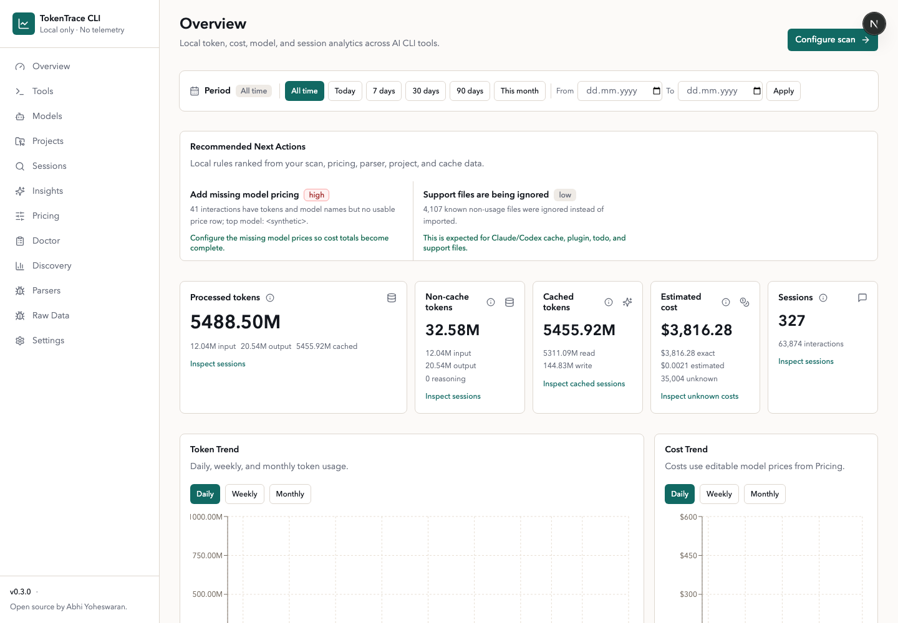
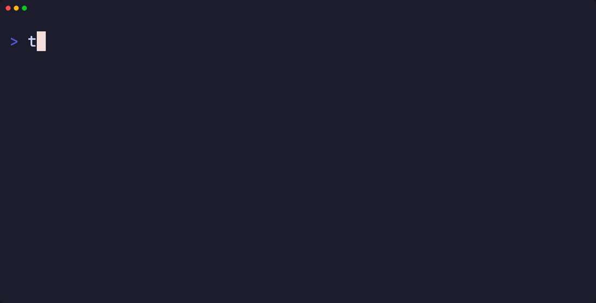
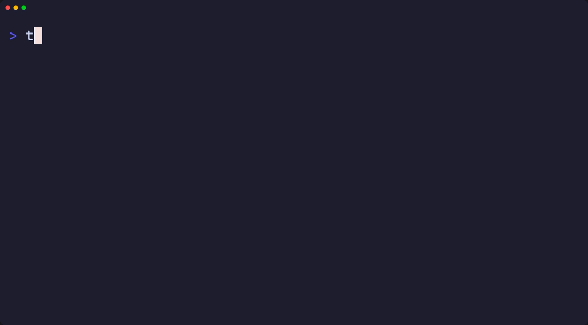
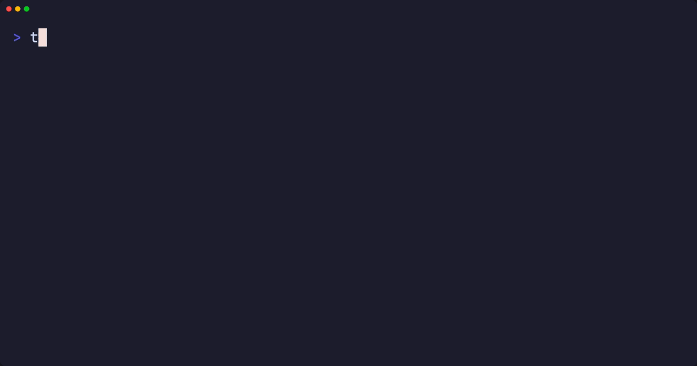
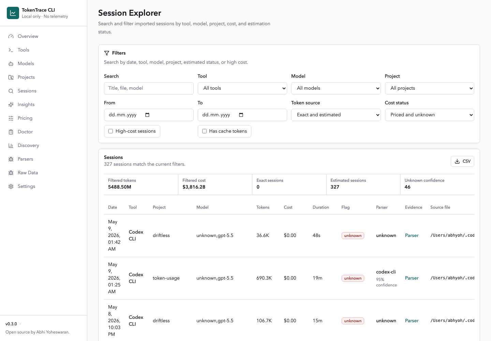
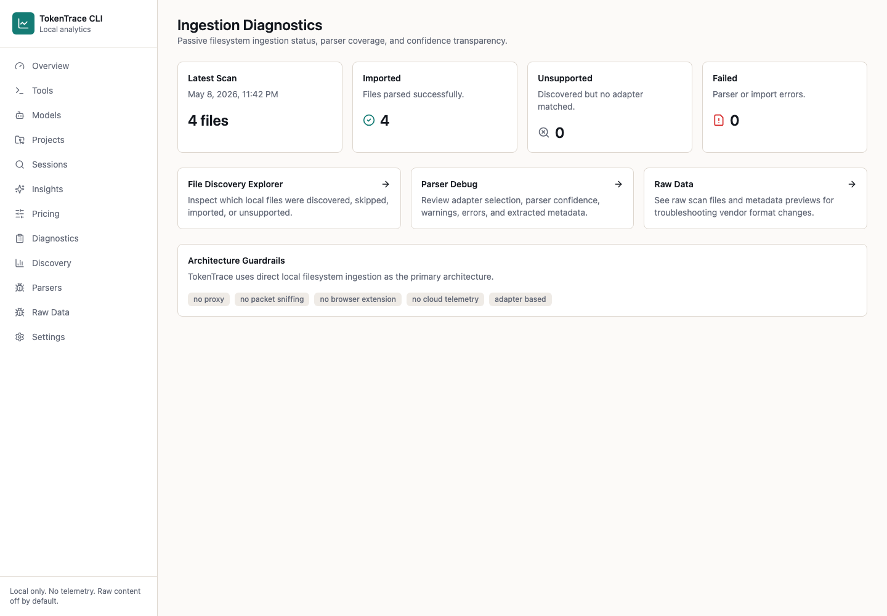
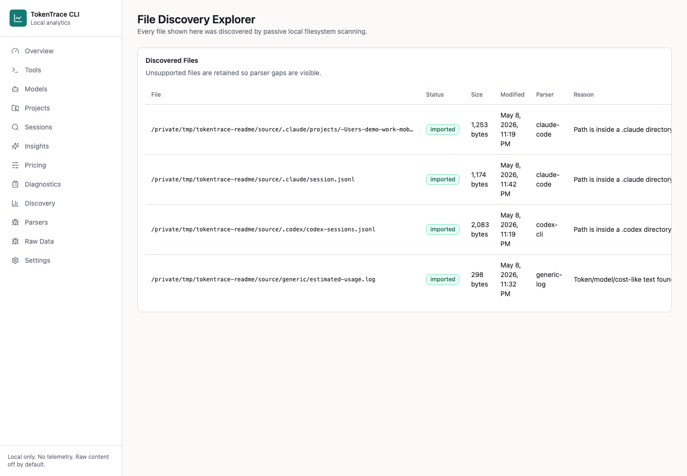
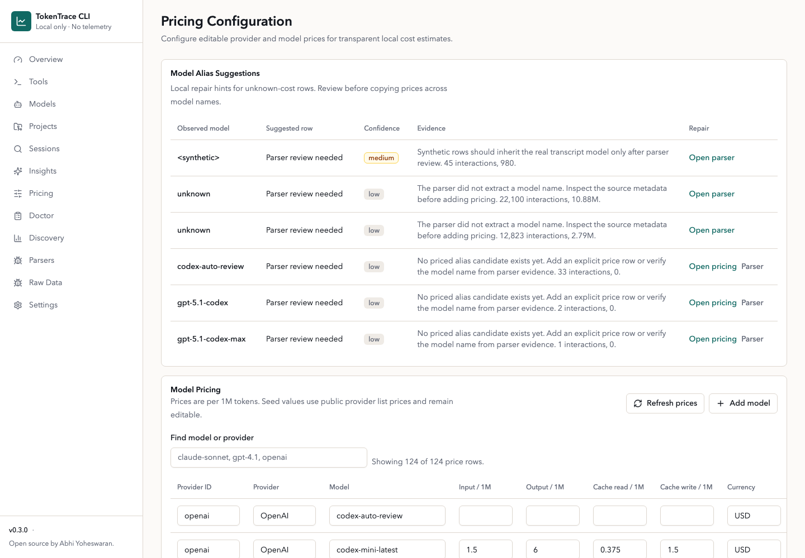
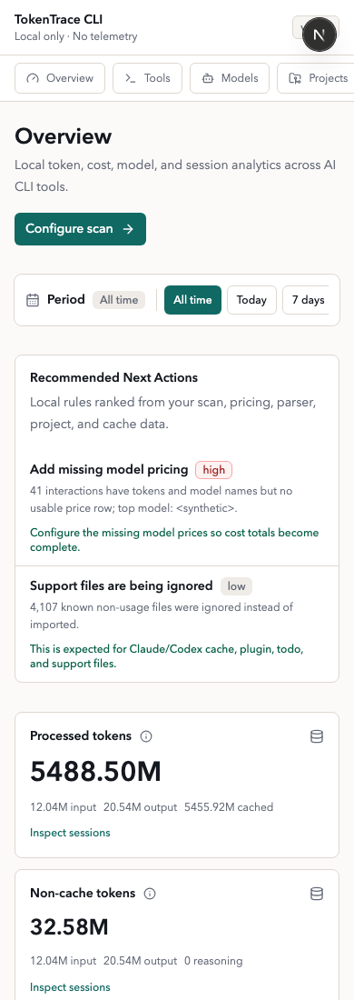

# TokenTrace CLI

Local-first analytics for AI CLI usage. TokenTrace scans local CLI logs, normalizes token usage, estimates missing counts, and shows cost, model, project, and session analytics in a browser dashboard.

TokenTrace is designed for local development machines first, with macOS-oriented defaults. It does not require a cloud account and does not send telemetry or logs anywhere.



## Start In Seconds

Run without installing:

```bash
npx tokentrace
```

Or install globally:

```bash
npm install -g tokentrace
tokentrace
```

The command starts the local dashboard, chooses an available localhost port starting at `3030`, opens your default browser, and keeps the server running until you press `Ctrl+C`.

CLI commands:

```bash
tokentrace              # Start local dashboard
tokentrace serve        # Start local dashboard
tokentrace scan         # Scan local AI CLI usage logs
tokentrace pricing refresh
                        # Refresh public model prices
tokentrace run <cmd>    # Optional wrapper mode for command runtime diagnostics
tokentrace reset        # Reset imported local data
tokentrace reset --yes  # Reset without confirmation
tokentrace --help       # Print help
tokentrace --version    # Print version
```

## Run From Source

```bash
npm install
npm run db:migrate
npm run db:seed
npm run dev
```

Open `http://localhost:3000`.

Useful source commands:

```bash
npm run dev          # Start the Next.js dev server
npm run build        # Build the production app
npm run start        # Serve the production build
npm run scan         # Scan default and configured folders
npm run db:migrate   # Create/update local SQLite tables
npm run db:seed      # Seed editable provider/model prices
npm run reset        # Clear imported data and scan history
npm test             # Run parser and cost tests
```

In local development, the SQLite database defaults to `.tokentrace/tokentrace.db`. Override it with:

```bash
TOKENTRACE_DB=/absolute/path/tokentrace.db npm run dev
```

## Data Location

When installed from npm, TokenTrace stores runtime data outside the package folder:

- macOS: `~/Library/Application Support/TokenTrace/`
- Linux: `~/.local/share/tokentrace/`
- Windows: `%APPDATA%/TokenTrace/`

The CLI sets `TOKENTRACE_DB` and `DATABASE_URL` automatically. You can override the base directory with:

```bash
TOKENTRACE_HOME=/custom/path tokentrace
```

If `npm install -g tokentrace` prints a `prebuild-install` deprecation warning, it is from the native SQLite dependency chain used by `better-sqlite3`. The install should continue normally, and TokenTrace still runs locally.

## Where TokenTrace Looks

Default discovery checks these locations when present:

- `~/.claude/`
- `~/.config/claude/`
- `~/.codex/`
- `~/.config/codex/`
- `~/.openai/`
- Project-level hidden folders such as `.claude`, `.codex`, `.openai`, and `.ai` in the directory where `tokentrace` was invoked
- TokenTrace wrapper logs in the local app-data directory
- Any custom folders configured in Settings

Use **Settings** in the dashboard to add custom folders, toggle raw message storage, and trigger scans. Use **Diagnostics**, **Discovery**, **Parser Debug**, and **Raw Data** to inspect discovered files, parser decisions, warnings, failures, extracted metadata, and confidence levels.

## Ingestion Architecture

TokenTrace's primary ingestion architecture is direct local filesystem ingestion:

1. Discover local AI CLI artifacts.
2. Parse supported formats through adapters.
3. Normalize sessions, interactions, token usage, models, projects, and tool calls.
4. Store normalized records locally in SQLite.
5. Visualize analytics in the local dashboard.

TokenTrace does not use MITM proxies, packet sniffing, browser extensions, traffic interception, or cloud telemetry.

Each adapter detects compatibility, parses partial metadata where possible, and fails safely when a file format is unsupported. Imported interactions carry token confidence metadata:

- `exact`
- `high-confidence estimate`
- `low-confidence estimate`
- `unknown`

Exact and estimated token values are never mixed silently.

## Optional Wrapper Mode

Filesystem ingestion is the primary product path. Wrapper mode is secondary and optional:

```bash
tokentrace run claude-code
tokentrace run codex
tokentrace run npm test
```

Wrapper mode launches the subprocess, measures duration, counts stdout/stderr bytes, detects structured JSON output when available, and writes a local JSONL diagnostic log under the app-data directory. It does not intercept network traffic.

## Screenshots

CLI startup and help:



Local scan output:



Optional wrapper diagnostics:



Session exploration:



Ingestion diagnostics and file discovery:





Editable model pricing:



Mobile overview:



## Privacy Model

- All processing runs locally on your machine.
- No external telemetry is included. Next.js telemetry is disabled by the CLI.
- No cloud account is required.
- Raw full prompts and responses are not stored by default.
- TokenTrace stores short text previews for debugging and analytics context.
- TokenTrace may download a public model-pricing manifest so cost estimates stay useful. It does not send usage logs, prompts, file paths, or analytics data with that request. Set `TOKENTRACE_DISABLE_PRICE_REFRESH=1` to use only bundled prices.
- Turn on **Store raw message content** in Settings only if you want full local message text preserved in SQLite.

Stop the server with `Ctrl+C` in the terminal where `tokentrace` is running.

## Pricing

Model prices change. TokenTrace ships with bundled public list prices and can refresh them from a public TokenTrace pricing manifest. Manual edits made in **Pricing** are preserved by future refreshes.

The bundled catalog includes common OpenAI, Anthropic, Google Gemini, xAI, DeepSeek, Mistral, and Cohere models, checked on May 8, 2026.

Seed sources:

- [OpenAI API pricing](https://openai.com/api/pricing/) and [OpenAI model docs](https://developers.openai.com/api/docs/models)
- [Anthropic Claude pricing](https://platform.claude.com/docs/en/about-claude/pricing)
- [Gemini Developer API pricing](https://ai.google.dev/gemini-api/docs/pricing)
- [xAI models and pricing](https://docs.x.ai/developers/models)
- [DeepSeek models and pricing](https://api-docs.deepseek.com/quick_start/pricing)
- [Mistral model docs](https://docs.mistral.ai/models)
- [Cohere pricing](https://cohere.com/pricing)

Review and update prices in **Pricing** before treating cost estimates as financial truth, especially if you use batch processing, priority/flex modes, data residency, long-context surcharges, subscriptions, or provider-specific discounts.

Refresh from the dashboard or from the CLI:

```bash
tokentrace pricing refresh
```

Cost is calculated per interaction:

```text
inputTokens * inputPricePer1M / 1,000,000
+ outputTokens * outputPricePer1M / 1,000,000
+ cacheReadTokens * cachedInputPricePer1M / 1,000,000
+ cacheWriteTokens * cacheWritePricePer1M / 1,000,000
```

Cache read and cache write prices fall back to input price when a model has no separate cache rate. Anthropic seed rows use the 5-minute prompt cache write price by default. Rows are marked exact, estimated, or unknown depending on token availability and pricing configuration.

## Supported Inputs

Adapters live under `src/ingestion/adapters/`:

- `claude-code.ts`
- `codex-cli.ts`
- `generic-jsonl.ts`
- `generic-json.ts`
- `generic-log.ts`

Formats for Claude Code and Codex CLI can vary across versions, so these adapters are defensive and best-effort. Unknown files fail safely and show warnings in the Raw Data page.

## Extending Parsers

Example generic JSONL fixtures are in `fixtures/generic-jsonl/`.

The ingestion system is intentionally pluggable:

1. Add an adapter implementing `IngestionAdapter`.
2. Register it in `src/ingestion/adapters/index.ts`.
3. Add parser tests under `tests/`.

## Known Limitations

- Claude Code and Codex CLI log formats are inferred defensively and may need refinement with real sample logs.
- Token estimation uses a simple conservative `characters / 4` approximation.
- SQLite log ingestion is not implemented yet, though the adapter boundary is ready for it.
- Seed prices are editable and should be verified manually for your account, region, and provider plan.

## License

Open source by [Abhi Yoheswaran](https://github.com/abhiyoheswaran1). Released under the MIT License. See `LICENSE`.

## Next Improvements

- Add tokenizer-backed estimates per provider/model.
- Add native SQLite-history adapters for tools that store usage in local databases.
- Add richer drilldowns for individual sessions and tool calls.
- Add import profiles for teams that use shared local log conventions.
